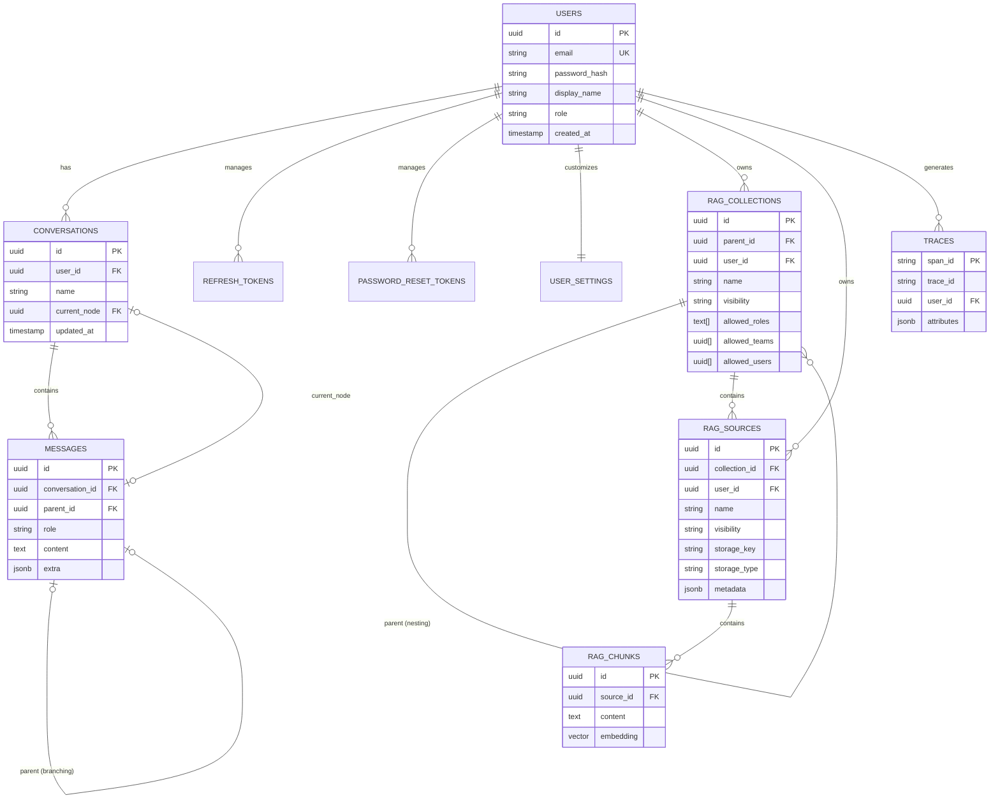

# BeyondCloud Database Schema & ER Diagram

This document provides a map of the database structure and an evaluation of its robustness and security features.

## ER Diagram

## Robustness & Security Analysis

### 1. Identity & Access Control
- **User IDs (UUIDs)**: Every table containing user data uses a `user_id` linked back to the `users` table.
- **Secure IDs**: We use **UUID v4** (random) instead of sequential integers. This prevents "ID enumeration" attacks.
- **Authentication Linking**: API endpoints verify the JWT token, extract the `user_id`, and then query the database using that ID.

### 2. Data Integrity
- **Foreign Keys**: We use `REFERENCES` constraints everywhere.
- **Cascading Deletes**: Most relationships use `ON DELETE CASCADE`. If a user deletes a conversation, all its messages are purged.
- **Triggers**: PostgreSQL triggers automatically update `updated_at` timestamps.

### 3. RAG Visibility
- **Isolation**: RAG queries filter by `(user_id = :current_user OR visibility = 'shared')`.

### 4. Performance
- **Indexing**: Indices on `user_id`, `conversation_id`, and `email` for fast lookups.
- **Vector Indexing**: especializados indices for `pgvector` columns.

### 5. Session Security
- **Token Rotation**: The `refresh_tokens` table tracks active sessions.
- **Password Safety**: Stored using `bcrypt` hashes.
