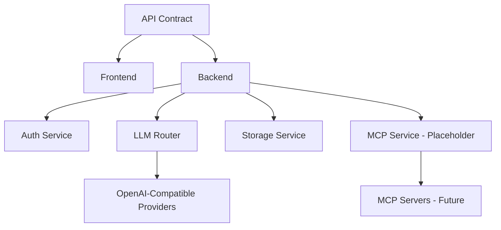

# Component-Based Architecture

## Overview

This document defines the independent components of the llama.cpp Authenticated WebUI. Each component can be developed in parallel once API contracts are defined.

**Key Feature**: Two backend implementations (Python/FastAPI and Node.js/Express) following the same API contract - choose your preference!

---

## Component Diagram

```
┌─────────────────────────────────────────────────────────────────────┐
│                         FRONTEND (Svelte)                            │
│  ┌──────────────┐  ┌──────────────┐  ┌──────────────────────────┐   │
│  │ Auth UI      │  │ Chat UI      │  │ Settings UI              │   │
│  │ - Login      │  │ - Messages   │  │ - Providers              │   │
│  │ - Register   │  │ - Sidebar    │  │ - MCP Servers            │   │
│  └──────────────┘  └──────────────┘  └──────────────────────────┘   │
└─────────────────────────────────────────────────────────────────────┘
                              │
                    REST API (Defined Contract)
                    See: api-contract.md
                              │
              ┌───────────────┴───────────────┐
              ▼                               ▼
┌──────────────────────────┐    ┌──────────────────────────┐
│   BACKEND-PYTHON         │ OR │   BACKEND-NODEJS         │
│   (FastAPI)              │    │   (Express)              │
│                          │    │                          │
│  Same API Contract!      │    │  Same API Contract!      │
│  Choose your preference  │    │  Choose your preference  │
└──────────────────────────┘    └──────────────────────────┘
              │                               │
              └───────────────┬───────────────┘
                              │
              ┌───────────────┼───────────────┐
              ▼               ▼               ▼
        ┌──────────┐   ┌──────────┐   ┌──────────────┐
        │PostgreSQL│   │LLM APIs  │   │ MCP Servers  │
        │          │   │(OpenAI,  │   │ (Future)     │
        └──────────┘   │Gemini..) │   └──────────────┘
                       └──────────┘
```

---

## Backend Options

| Choose Based On | Python/FastAPI | Node.js/Express |
|-----------------|----------------|-----------------|
| **Team expertise** | Python devs | JavaScript/TypeScript devs |
| **ML/AI integration** | ✅ Better | Good |
| **Async performance** | Excellent | Excellent |
| **Type safety** | Pydantic | TypeScript + Zod |
| **ORM** | SQLAlchemy | TypeORM |
| **Auto API docs** | ✅ Swagger built-in | Needs setup |
| **MCP SDK** | `mcp` (PyPI) | `@modelcontextprotocol/sdk` |

---

## Component 1: Frontend (Independent)

**Technology**: Svelte 5 + SvelteKit

**Can develop independently once API contract is defined.**

### Subcomponents

| Component | Responsibility | Status |
|-----------|----------------|--------|
| Auth UI | Login, Register, Forgot Password pages | To Build |
| Chat UI | Messages, Conversations, Sidebar | Exists (modify) |
| Settings UI | Provider config, API keys, MCP config | To Build |
| Provider Selector | Select LLM backend | To Build |
| MCP Config UI | Configure MCP servers (placeholder) | Placeholder |

### Frontend API Client

```typescript
// src/lib/services/api.ts - Single client for all backend calls
class ApiClient {
  // Auth
  register(email, password): Promise<User>
  login(email, password): Promise<{ accessToken, refreshToken }>
  logout(): Promise<void>
  refreshToken(): Promise<{ accessToken }>
  forgotPassword(email): Promise<void>
  resetPassword(token, password): Promise<void>
  
  // Conversations
  getConversations(): Promise<Conversation[]>
  createConversation(name): Promise<Conversation>
  deleteConversation(id): Promise<void>
  
  // Messages
  getMessages(convId): Promise<Message[]>
  
  // Chat (proxied to LLM)
  chatCompletion(messages, options): AsyncGenerator<string>
  
  // Settings
  getSettings(): Promise<Settings>
  updateSettings(settings): Promise<Settings>
  
  // Providers
  getProviders(): Promise<Provider[]>
  testProvider(provider): Promise<boolean>
  
  // MCP (Placeholder)
  getMcpServers(): Promise<McpServer[]>
  getMcpTools(serverId): Promise<Tool[]>
  callMcpTool(serverId, toolName, args): Promise<any>
}
```

---

## Component 2: Backend (Independent)

**Technology**: Node.js/Express or Python/FastAPI

**Can develop independently - just implement the API contract.**

### Subcomponents

| Component | Responsibility | Status |
|-----------|----------------|--------|
| Auth Service | User auth, JWT, password reset | To Build |
| Chat Service | Handle chat requests | To Build |
| LLM Router | Route to correct LLM provider | To Build |
| Storage Service | PostgreSQL CRUD | To Build |
| Settings Service | User settings management | To Build |
| MCP Service | MCP client integration | Placeholder |

### Backend API Contract

See `api-contract.md` for full specification.

---

## Component 3: LLM Router (Independent)

**Purpose**: Abstract LLM provider differences

```typescript
interface LLMRouter {
  // Route chat request to appropriate provider
  chat(provider: Provider, messages: Message[], options: ChatOptions): AsyncGenerator<Chunk>
  
  // List available models for a provider
  listModels(provider: Provider): Promise<Model[]>
  
  // Test provider connection
  testConnection(provider: Provider): Promise<boolean>
}
```

**Supported Providers** (OpenAI-compatible):
- llama.cpp, Ollama, OpenAI, Gemini, Groq, Azure, vLLM

---

## Component 4: MCP Service (Placeholder)

**Purpose**: Connect to MCP servers, expose tools to LLM

**Status**: Placeholder - develop later, conform to interface

```typescript
interface MCPService {
  // Server management
  addServer(config: McpServerConfig): Promise<McpServer>
  removeServer(serverId: string): Promise<void>
  listServers(): Promise<McpServer[]>
  
  // Tool discovery
  listTools(serverId: string): Promise<Tool[]>
  
  // Tool execution
  callTool(serverId: string, toolName: string, args: any): Promise<ToolResult>
  
  // Convert MCP tools to OpenAI function format
  getOpenAITools(): Promise<OpenAITool[]>
}

// Placeholder implementation
class MCPServicePlaceholder implements MCPService {
  async addServer() { throw new Error("MCP not implemented yet"); }
  async listServers() { return []; }
  async listTools() { return []; }
  async callTool() { throw new Error("MCP not implemented yet"); }
  async getOpenAITools() { return []; }
}
```

---

## API Contract (Enables Parallel Development)

Once these endpoints are defined, frontend and backend can develop independently:

### Auth Endpoints
```
POST /api/auth/register
POST /api/auth/login
POST /api/auth/logout
POST /api/auth/refresh
POST /api/auth/forgot-password
POST /api/auth/reset-password
GET  /api/auth/me
```

### Conversation Endpoints
```
GET    /api/conversations
POST   /api/conversations
GET    /api/conversations/:id
PUT    /api/conversations/:id
DELETE /api/conversations/:id
```

### Message Endpoints
```
GET    /api/messages/:convId
POST   /api/messages
PUT    /api/messages/:id
DELETE /api/messages/:id
```

### Chat Endpoints (LLM)
```
POST /api/chat/completions  (streaming supported)
GET  /api/models
POST /api/providers/test
```

### Settings Endpoints
```
GET  /api/settings
PUT  /api/settings
GET  /api/providers
```

### MCP Endpoints (Placeholder)
```
GET    /api/mcp/servers
POST   /api/mcp/servers
DELETE /api/mcp/servers/:id
GET    /api/mcp/servers/:id/tools
POST   /api/mcp/tools/call
```

---

## Development Strategy

### Phase 1: Define Contracts (Do First)
- Document all API endpoints with request/response schemas
- Create TypeScript interfaces for all types
- Both teams agree on contract

### Phase 2: Parallel Development
```
Frontend Team                Backend Team
─────────────                ────────────
Mock API responses           Implement real endpoints
Build all UI components      Build services
Test against mocks           Test with Postman
                    ↓
            Integration Testing
```

### Phase 3: Integration
- Connect frontend to real backend
- Integration testing
- Fix any contract mismatches

---

## Placeholder Pattern

For components like MCP that come later:

```typescript
// 1. Define interface now
interface MCPService { ... }

// 2. Create placeholder implementation
class MCPServicePlaceholder implements MCPService {
  async listServers() { return []; }  // Empty, not error
  async addServer() { 
    throw new NotImplementedError("MCP coming in Phase 7");
  }
}

// 3. UI shows "Coming Soon" or hides feature
{#if mcpEnabled}
  <McpConfigPanel />
{:else}
  <p class="text-muted">MCP integration coming soon</p>
{/if}

// 4. Later: Replace placeholder with real implementation
class MCPServiceReal implements MCPService { ... }
```

---

## Component Dependencies



**Key**: API Contract blocks nothing - once defined, all components can proceed independently.
